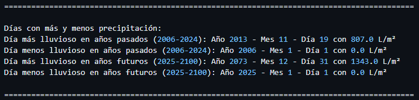

# Organizar y procesar los datos

El objetivo de este segundo día de trabajo en la actividad 2 era encontrar errores en los datos que hemos descargado de la AEMET. Para ello necesitamos generar un script que encuentre errores en los datos y los muestre por pantalla. Si no encuentra errores en nuestros ficheros, podemos modificar uno de los archivos .dat y simular un error en los datos para ver si nuestro script funciona.
Cuando detectemos un problema lo guardamos en un archivo de log.

## Errores encontrados 

P1 - Diciembre de 2006 solo contamos con datos de precipitaciones de 1 solo día y del resto no contamos con ningún dato. Por lo tanto faltan valores. 

> **Lectura de ficheros:** Nos tenemos que asegurar de que todos los ficheros tienen el mismo formato y que aparentemente són correctas. Ya que si hay algun error nuestro programa lo localizará para poder resolverlo facilmente.

## Paso 1

Podemos ver que los datos recolectados mediante la tarea 1 se dividen en las siguientes columnas:

| Dato 1 | Dato 2 | Dato 3 | Dato 4 | Dato 5 |
|--------|--------|--------|--------|--------|
| ID del pluviómetro | Año | Mes | Precip día 1 | Precipit día 2 ... |

> **⚠️ Dato -999 ⚠️** --> Sin datos registrados por error de parte de la estación meteorologica.
> **Precipitaciones** --> Las precipitaciones las mide en milímetros = litros por metro cuadrado. Los datos que tenemos por día reflejan cuánta lluvia ha registrado un pluviómetro cada día.

## Paso 2
Verificar que todos los archivos tienen el mismo formato.
Se puede realizar un script de validación básica que lea las primeras filas de cada archivo y determine el número de columnas y delimitadores. Los delimitadores son espacios. 
Hemos pedido que nos haga un script que nos muestre por pantalla el número columnas y de delimitadores que tiene cada documento.

## Paso 3
Limpieza de los datos.
Asegurar que los datos no contengan errores, valores que falten o inconsistencias:
Lectura: Utilizar pandas para gestionar los archivos y gestionar errores de lectura.
Verifica la consistencia de las columnas: Asegurar que los datos en cada columna tienen el tipo esperado (numérico, fecha, etc.).
Gestionar valores que faltan o corruptos: Identifica y trata datos nulos o valores atípicos.

## Paso 4 

Documenta todo el proceso por si tienes que repetirlo alguna vez.
Indica qué decisiones has tomado, qué has hecho con los valores nulos y cómo has solucionado inconsistencias.
 
### Decisiones tomadas 

Hemos tenido en cuenta que las dos primeras filas de cada “precipitación” siempre contienen la misma información pero con la diferencia de que estos datos pueden variar. A partir de la fila 2, la primera columna nos dirá el identificador de la estación, la segunda columna nos indica el año en el que se registraron los datos que vienen a continuación y la tercera columna nos indica el mes de dicho año. Después, los datos que siguen nos indican las precipitaciones día por día, por lo tanto habrá 31 datos y dependiendo del mes, si un mes tiene menos de 31 días, el dato que mostrará de los días faltantes será -999, también hay que tener en cuenta que los datos se encuentran separados por espacios. 
Teniendo en cuenta esto, para validar los archivos.dat hemos creado un script en Python que se encarga de validar los datos y mostrar error si los datos son incorrectos.

Los datos del encabezado son los siguientes - equivalente a las dos primeras líneas de cada archivo .dat:

- Encabezado
-  precip
	- P1(el valor identificativo)
- MIROC5
	- 35.307 (latitud)
- RCP60
	- -2.948 (longitud)
- REGRESION 
- 182 (no sabemos a qué se refiere este dato)
- decimas
	-2006 (año de inicio)
	- 2100 (año final)

Después de comprobar el encabezado podemos comprobar que los datos recopilados por los pluviómetros sean correctos de acuerdo al encabezado.

Las columnas sirven para aclarar cuál es el orden en el cual tienen que ir los valores.

- P1 (el valor identificativo) (columna 1)
- 2006 (año) (columna 2)
- 1 (mes) (columna 3)
- 1 (cualquier número) (columna 2)
- -999 (cualquier número) (columna 34)

A la hora de comprobar los valores que tienen que estar relacionados con el encabezado, hemos conseguido que el script detecte si hay un error en la validación de estos, a excepción de las coordenadas que son obviadas por el script.
También hemos conseguido que detecte errores fuera del encabezado, por lo tanto, a partir de la línea 3 de cada archivo .dat, el script detectará: 
- Si hay alguna letra en algún valor que no sea el valor identificativo P de la primera columna.
- Que entre los valores hay dos separaciones o una tabulación para separarlos.
- Si los años no van acorde a los límites declarados (2006-2100).
- Que los meses sean del 1 al 12 y que haya 31 valores recolectados por el pluviómetro, es decir, entre la columna siguiente de los meses y la última habrá 31 valores, algunos de ellos -999 si el mes tiene menos de 31 días.

En el archivo .log nos extraera los siguientes resultados además de los errores en caso de que los haya:
- Total de archivos procesados: x
- Total de líneas procesadas: x
- Total de valores procesados (excluyendo -999) x
- Total de valores faltantes (-999): x
- Porcentaje de valores faltantes sobre el total de valores: x%

{: width="100%" align="center" style="display: block; margin-left: auto; margin-right: auto;"}

{: width="100%" align="center" style="display: block; margin-left: auto; margin-right: auto;"}

{: width="100%" align="center" style="display: block; margin-left: auto; margin-right: auto;"}

{: width="100%" align="center" style="display: block; margin-left: auto; margin-right: auto;"}

{: width="100%" align="center" style="display: block; margin-left: auto; margin-right: auto;"}

Después de algunos cambios, hemos conseguido actualizar nuestro código para que valide varios datos correctamente:
- Valida los datos del encabezado
- Valida el pluviómetro
- Valida los años y meses, que siempre tengan el mismo formato, que no se repitan y que no haya más de 31 datos correspondiendo a los días.

{: width="100%" align="center" style="display: block; margin-left: auto; margin-right: auto;"}

{: width="100%" align="center" style="display: block; margin-left: auto; margin-right: auto;"}

{: width="100%" align="center" style="display: block; margin-left: auto; margin-right: auto;"}

A parte de validar datos, también hemos conseguido avanzar con el siguiente punto. 
Análisis de datos:

- Medias totales, anuales y tendencia de cambio (la tasa de variación anual de las precipitaciones):

{: width="100%" align="center" style="display: block; margin-left: auto; margin-right: auto;"}

La formula para calcular la tasa de variación anual:

{: width="100%" align="center" style="display: block; margin-left: auto; margin-right: auto;"}

- Extremos: los años com mas lluvia y los mas secos separados entre los años pasados y los futuros:

{: width="100%" align="center" style="display: block; margin-left: auto; margin-right: auto;"}

Se me ocurrió separar los años pasados y los años futuros, creo que para los próximos ejercicios nos podría ser útil.

{: width="100%" align="center" style="display: block; margin-left: auto; margin-right: auto;"}

Para analizar los datos, se me ocurrió añadir los siguientes datos: 

- Promedio total de precipitaciones por período: calcula el promedio total de precipitación acumulada para dos períodos: años pasados (2006-2024) y proyecciones futuras (2025-2100).
- Años con el Mayor Incremento o Decremento de Precipitación Anual: identifica los años con el mayor aumento o disminución porcentual en la precipitación anual comparada con el año anterior. Expresado en l/m2 al año.

{: width="100%" align="center" style="display: block; margin-left: auto; margin-right: auto;"}

- ¿Cuáles fueron los días que más ha llovido en todos los años pasados del 2006 al 2024?
- ¿Cuáles fueron los días que menos?
- ¿Cuáles serán los días que más lloverán del 2025 al 2100 y los días que menos lloverán?

{: width="100%" align="center" style="display: block; margin-left: auto; margin-right: auto;"}

## Decisiones Finales

En cuanto al funcionamiento de nuestro script, hemos considerado que quedaría más pulcro que el script de validación de los datos fuera separado del archivo de análisis y creación de estadísticas sobre los datos. 
No obstante, los hemos configurado para que los archivos ejecutados por separado vuelquen los resultados en un archivo único llamado prueba.log. 
Hemos pensado que si en el futuro se necesitara actualizar los datos ya sea porque los datos predictivos pasan a ser reales o porque podemos entender que la predicción puede ir cambiando si la sociedad toma conciencia se puede actualizar el script para que el archivo que se cree tenga un nombre que autoincremente. 

Asimismo, esta es una guía del uso de los archivos:

validación_datos.py: valida los datos y muestra un resumen de los resultados por pantalla

estadistica.py: crea estadísticas y analiza los datos

Recomendamos ejecutar primero el archivo de validación y después el de estadística.

[**Índice**](../README.md){: .btn .btn-primary .float-right}

