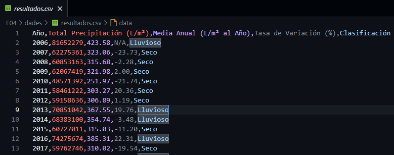
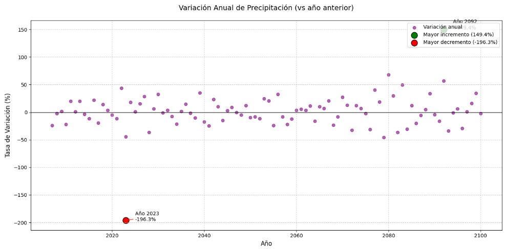
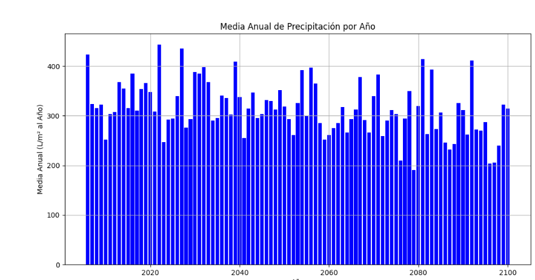

# Generar Resultados

> En el proceso de generación de resultados, nos encontramos con que algunos de los datos iniciales presentaban inconsistencias y errores. Esto nos llevó a revisar y rehacer el archivo de procesamiento de datos para asegurar la precisión y fiabilidad de la información.

## Juntar Archivos

El primer paso en nuestro flujo de trabajo fue consolidar los archivos de **validación** y **procesamiento de datos** en un único archivo. Este enfoque nos permitió manejar los datos de manera más eficiente y simplificar el proceso de exportación a formatos como CSV, así como la generación de gráficos.

### Detalles Técnicos:

- **Adaptación de Rutas:** Al unir los archivos, fue necesario ajustar todas las rutas relativas y absolutas en el código para asegurar que los scripts funcionaran correctamente.
- **Optimización del Código:** Se realizaron mejoras en la estructura del código para reducir la redundancia y mejorar la legibilidad, lo que facilitó el mantenimiento futuro.

## LOG

Para garantizar un seguimiento detallado de las operaciones realizadas, implementamos un archivo **.log**. Este archivo registra todos los eventos importantes, incluyendo errores, advertencias y mensajes informativos, proporcionando una traza auditiva completa del proceso.

### Características del Archivo .log:

- **Registro Detallado:** Cada entrada en el archivo .log incluye una marca de tiempo, el nivel de severidad (info, warning, error) y un mensaje descriptivo.
- **Menos Visual, Más Informativo:** Aunque no es tan visual como otros formatos, el archivo .log contiene información más detallada y técnica, lo que es invaluable para la depuración y el análisis posterior.

## CSV

Una vez que los datos fueron procesados y validados, procedimos a la creación de un archivo **CSV**. Este archivo contiene los datos más relevantes extraídos del archivo .log, pero organizados de una manera más estructurada y accesible.

### Ventajas del CSV:

- **Estructura Clara:** Los datos en el CSV están organizados en columnas y filas, lo que facilita su lectura y manipulación.
- **Información Relevante:** A diferencia del archivo .log, el CSV se centra en los datos más importantes, omitiendo información redundante o menos relevante.
- **Compatibilidad:** El formato CSV es ampliamente compatible con diversas herramientas de análisis de datos, hojas de cálculo y lenguajes de programación, lo que lo hace ideal para su uso en diferentes etapas del proyecto.

## Gráficos

El último paso en nuestro proceso fue la generación de **gráficos** que representaran visualmente los resultados obtenidos. Estos gráficos son esenciales para interpretar los datos de manera intuitiva y comunicar los hallazgos de manera efectiva.

### Tipos de Gráficos Generados:

- **Gráficos de Barras:** Para comparar cantidades entre diferentes categorías.

- **Gráficos de Líneas:** Para mostrar tendencias a lo largo del tiempo.

- **Gráficos de Dispersión:** Para identificar correlaciones entre variables.

### Herramientas Utilizadas:

- **Matplotlib y Seaborn:** Para la generación de gráficos en Python.
- **Plotly:** Para gráficos interactivos que pueden ser integrados en aplicaciones web.

## Conclusión

El proceso de generación de resultados fue un ciclo iterativo que involucró la consolidación de datos, la validación de su precisión, y la presentación visual de los hallazgos. Cada paso fue crucial para asegurar que los resultados finales fueran tanto precisos como comprensibles.

[**Volver al Índice**](../README.md){: .btn .btn-primary .float-right}
