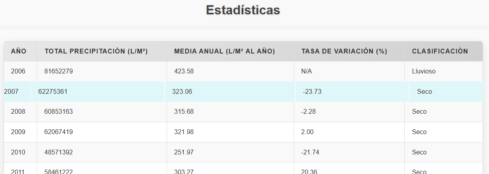
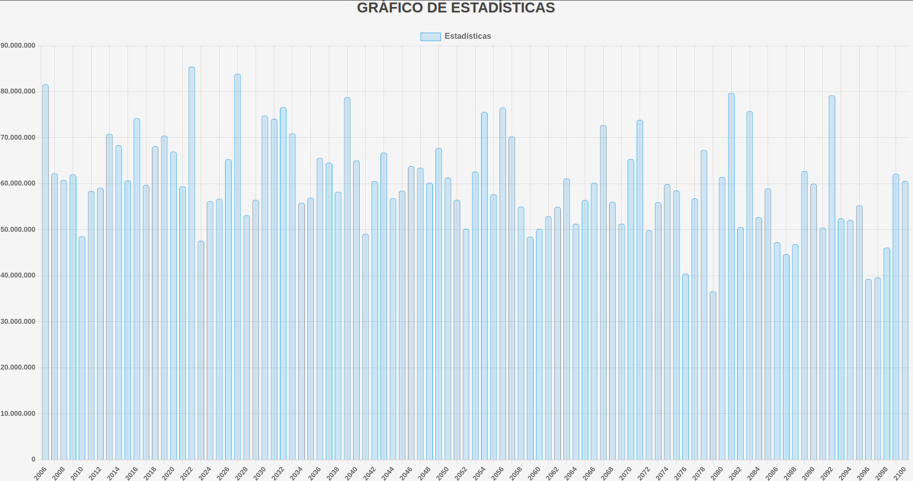

# Publicar los datos
El objetivo de la actividad 4 es recopilar los datos en una página HTML y hacerla pública. Para eso, hemos hecho 2 archivos: uno HTML y otro CSS, para crear una página que contenga una tabla, estadísticas y un gráfico de los datos que hemos procesado en los puntos anteriores.

## Decisiones tomadas
Decidimos hacer una tabla con todos los años que teníamos y presentar diversos datos, como los años que más ha llovido y los que menos, cuánto ha llovido cada año y la diferencia de lluvia entre los años.

{: width="100%" align="center" style="display: block; margin-left: auto; margin-right: auto;"}

Hemos creado un gráfico para representarlo de manera más visual y, para hacerlo más ameno, también hemos decorado la tabla y el gráfico con el CSS, añadiendo algunos colores pero sin que pierda la formalidad de un trabajo.

 {: width="100%" align="center" style="display: block; margin-left: auto; margin-right: auto;"}

[**Índice**](../README.md){: .btn .btn-primary .float-right}
