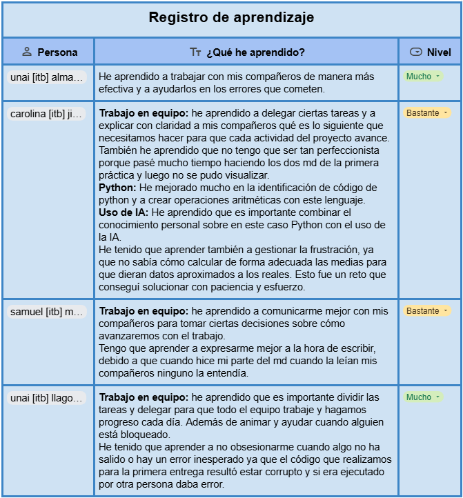

# Reflexión Final

La reflexión es una parte fundamental en cualquier proceso de aprendizaje, ya que nos permite analizar y evaluar nuestro propio desempeño, identificar lo que hemos aprendido y reconocer áreas de mejora. A través de esta actividad, cada miembro del equipo ha tenido la oportunidad de pensar de manera crítica sobre su contribución al proyecto, los desafíos que enfrentó y las habilidades que desarrolló durante el proceso.

En esta sección, presentamos las reflexiones individuales de cada integrante del grupo, donde compartimos nuestras experiencias, aprendizajes y propuestas de mejora. Este ejercicio no solo nos ayuda a consolidar los conocimientos adquiridos, sino también a crecer tanto a nivel personal como colectivo, preparándonos para futuros retos.

{: width="100%" align="center" style="display: block; margin-left: auto; margin-right: auto;"}

Como reflexión general, no creemos que haya errores humanos en los datos ya que los hemos extraído de una fuente fiable que genera estos datos con una API. Sin embargo, pensamos que es importante hacer control de errores de manera sistemática cuando descargamos datos de cualquier fuente para asegurarnos de que la información que vamos a crear de esos datos no es falsa.

[**Índice**](../README.md){: .btn .btn-primary .float-right}
